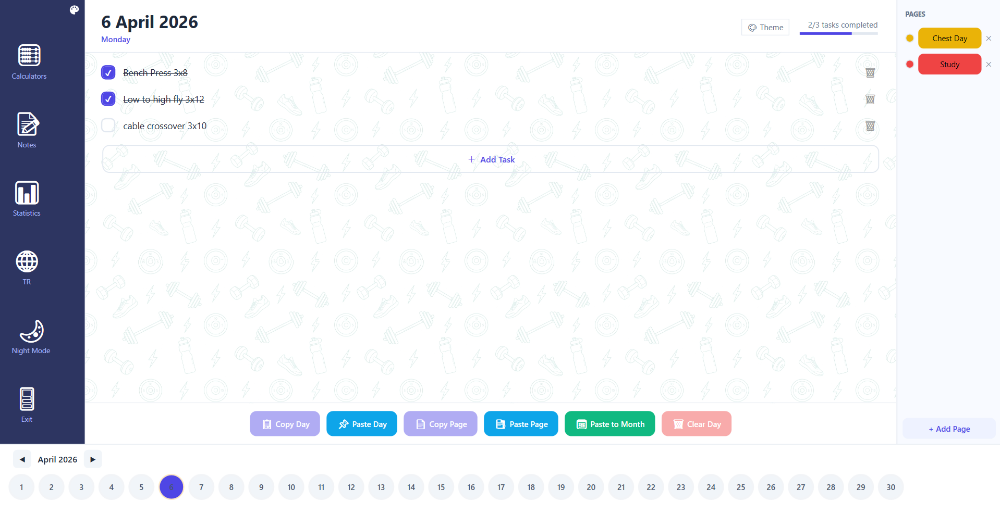
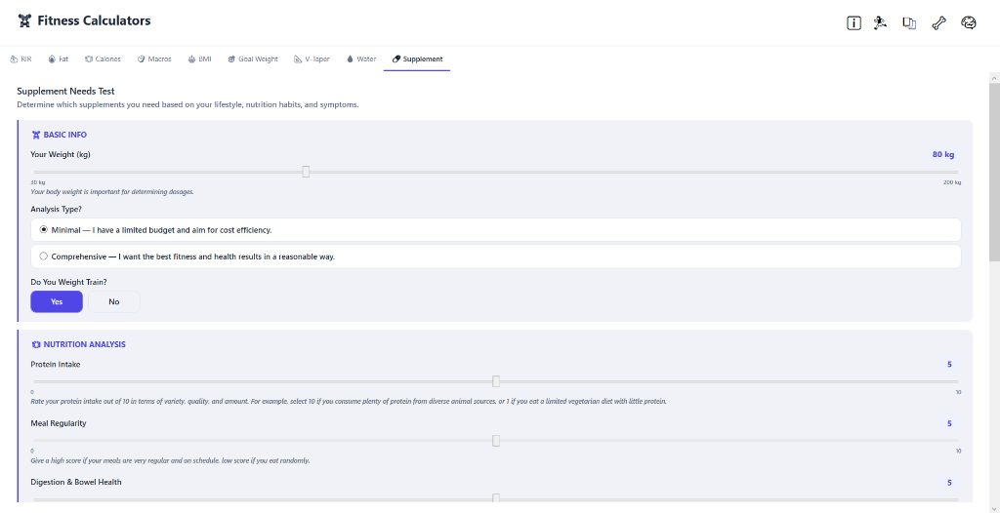
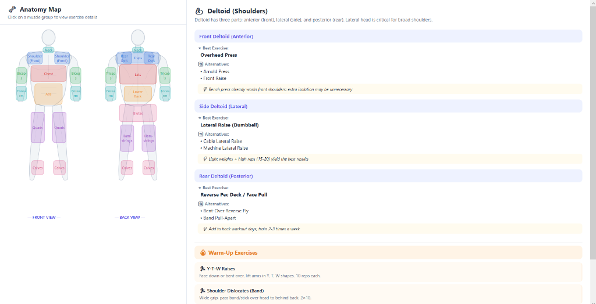
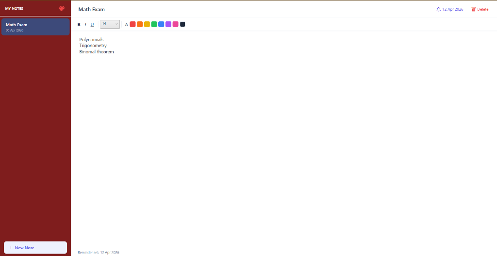

  

# 🗓️ Daily Planner & Fitness Assistant | Günlük Planlayıcı & Fitness Asistanı

  
  
  
  

**Daily Planner** is a high-performance **WPF (C#)** desktop application designed for maximum productivity and scientific fitness tracking. It's not just a planner; it's a personal coach, nutritionist, and health encyclopedia in your pocket.

**Daily Planner**, maksimum verimlilik ve bilimsel fitness takibi için tasarlanmış yüksek performanslı bir **C# (WPF)** masaüstü uygulamasıdır. Sadece bir planlayıcı değil; cebinizdeki kişisel koçunuz, beslenme uzmanınız ve sağlık ansiklopedinizdir.

---

## 🚀 Önemli Özellikler | Key Features

### 📝 1. Akıllı Not Sistemi | Smart Note System
- **TR:** Renk kodlu kategorizasyon ve gelişmiş koyu tema arayüzü ile notlarınızı kolayca yönetin.
- **EN:** Manage your notes easily with color-coded categorization and a modern dark theme interface.

### 📊 2. Bilimsel Hesaplayıcılar | Scientific Calculators
- **TR:** Vücut Yağ Oranı, Günlük Kalori (TDEE), Su İhtiyacı, BMI ve 1RM Güç Hesaplayıcıları.
- **EN:** Body Fat Percentage, Daily Calorie (TDEE), Water Intake, BMI, and 1RM Strength Calculators.

### 🦴 3. İnteraktif Anatomi Haritası | Interactive Anatomy Map
- **TR:** 12 ana kas grubuna tıklayarak en etkili egzersizleri ve ısınma rutinlerini (Warm-up) keşfedin.
- **EN:** Discover the most effective exercises and warm-up routines for 12 major muscle groups by clicking the visual map.

### 💊 4. Akıllı Supplement Testi | Smart Supplement Test
- **TR:** Yaşam tarzınıza, beslenmenize ve antrenmanınıza göre kişiselleştirilmiş takviye analizi ve kilo bazlı dozaj önerileri.
- **EN:** Personalized supplement analysis and weight-based dosage recommendations based on your lifestyle, nutrition, and training.

### 🧘 5. Esneklik & Mobilite Rehberi | Flexibility & Mobility Guide
- **TR:** Dinamik ısınma rutinleri, statik esnemeler ve eklem sağlığı için özel mobilite akışları.
- **EN:** Dynamic warm-up routines, static stretches, and specific mobility flows for joint health.

### 📅 6. Antrenman Splitleri | Training Splits
- **TR:** Full Body, PPL, ve Upper/Lower gibi bilimsel program türlerinin detaylı kıyaslamaları ve seçim rehberi.
- **EN:** Detailed comparisons and selection guides for scientific program types like Full Body, PPL, and Upper/Lower.

---

## 📸 Screenshots | Ekran Görüntüleri

<table style="width:100%">
  <tr>
    <td width="50%"></td>
    <td width="50%"></td>
  </tr>
  <tr>
    <td width="50%"></td>
    <td width="50%"></td>
  </tr>
</table>

> [!TIP]
> **TR:** Uygulamanın tüm özelliklerini keşfetmek için yukarıdaki görsellere göz atın!
> **EN:** Check out the images above to explore all the features of the application!

---

## 🌍 Dil Desteği | Language Support
The application is 100% localized | Uygulama %100 yerelleştirilmiştir:
- 🇹🇷 **Turkish** (Türkçe)
- 🇺🇸 **English** (İngilizce)

---

## 📂 Kurulum | Setup
1. **TR:** `DailyPlanner.sln` dosyasını Visual Studio ile açın ve **F5** ile çalıştırın.
2. **EN:** Open `DailyPlanner.sln` with Visual Studio and press **F5** to build and run.

---

### 🎨 Teknik Altyapı | Technical Stack
- **C# / .NET 4.8+ / WPF**
- **XAML** (Modern & Responsive UI)
- **JSON Persistence** (Local data storage)

---
> [!IMPORTANT]
> Consistency is the key to success. | Başarının anahtarı sürekliliktir!
